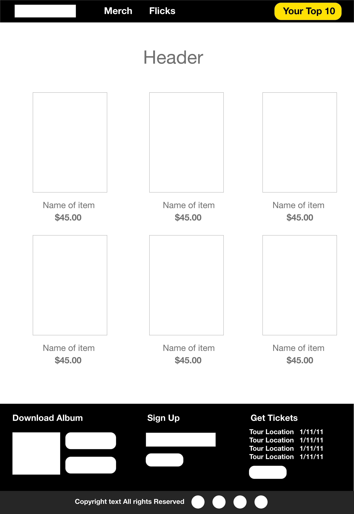

#Unit 3 - Astroworld Tour 

**Heroku Link**
http://astroworld-tour.herokuapp.com/

**Purpose** 
This app was designed to promote Travis Scott's latest album, Astroworld. The app features a page for fan's to upload images they snapped at his concert, as well as a page to preview the album and leave a review. 

**User Stories**

- As a user I want to be able to view tour merchandise

- As a user I want to see footage from the tour as well as share my own

- As a user I want to see upcoming tour dates and be able to purchase tickets

- As a user I want to listen to the album and leave a review

**Trello** 
https://trello.com/b/yKSfyy12/unit-3-mern-stack-app

**Wireframes**

- Adobe XD Link | https://xd.adobe.com/view/0102aff8-5fb6-487d-73d2-7150067c5d76-7733/

**Final Design**

**Resources**
- Bulma https://bulma.io/
- React Rating https://www.npmjs.com/package/react-rating
- Scroll in Nav https://gist.github.com/brthornbury/27531e4616b68131e512fc622a61baba

**Tech Used**
- Javascript
- Express
- Mongoose
- MongoDB
- NodeJs
- ReactJs

**Lessons I've Learned**
- I've learned to not be afraid of experimenting and trying new things within my code. 
- I was able to reach my mvp ahead of the deadline which gave me able time to tackle a few of my stretch and spend more time on the styling of the app. 

**2.0 features**
- Add functionality to the upload image form
- Add authentication for users on the gallery page 
- Add a custom music player for the listening party page
